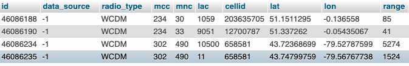
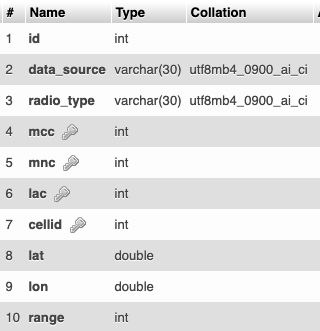

# Задание

### История

Недавно Вася произвел обратную разработку некоторого носимого устройства, которое может определять свое местоположение по силе сигнала от базовых станций (сотовых вышек, далее - БС). Однако Васе не понравилось, что часы работают через свой сервер и информацией делятся не всегда. Поэтому он решил написать свой сервер для этого девайса с блэкджэком и плюшками. Однако он не знает, как сделать так, чтобы по идентификаторам БС и силам сигнала от них сервер производителя выдавал приблизительные географические координаты устройства. При этом Вася точно знает, что так можно сделать. Вася начал подступаться к этой задачке и нашел открытую mysql базу данных с координатами БС в интересующем Васю регионе. Измерения с устройства Вася записал в json файл. Помогите Васе написать модуль для его сервера, который будет выдавать приблизительные координаты устройства по данным с него.

### ТЗ

Реализуйте класс `LBSGeoAPI` на языке Java, который по входным данным с устройства (Изначально они даны в json файле `first.json` и `second.json`) и с помощью обращения к БД БС по сети выдает координаты устройства в системе координат **WGS84**. (обычные гео-координаты) Координаты должны быть получены _без_ использования сторонних API: Google, Yandex, Opencellid и другие использовать нельзя. Подгрузку из json нужно делать в отдельном классе.

### Details

 - **MySQL БД**
 **ip**: пишите мне
 **port**: ...
 **username**: `ro1`
 **passwd**: `y71mM7!l257G5Q60`

**Структура**



 - **JSON с данными**
```json
[
    { // <-- Измерение в некоторый момент времени
        "timestamp": 1611742552.674557, // long
        "mcc": 250, // int Mobile Country Code
        "mnc": 1, // int Mobile Network Code **WARN** иногда девайс передает код сети 255 и врет. Код сети всегда 1.
        "cells": [
            {
                "lac": 31337, // int Location Area Code
                "cellid": 1337, // int Cell ID
                "power": 155 // int Сила сигнала от соты **WARN** тут должны были быть децибеллы, но китайцы прикольнулись :)
            },
            ...
        ]
    },
    ...
]
```

### Пример

В двух файлах содержатся измерения с устройства, проведенные в двух местах:
 - На речном вокзале (~`55.008046, 82.938004` +- 10 метров)
    Файл: `first.json`
 - Возле старого главного корпуса НГУ (~`54.842572, 83.092238` +- 300 метров).
    Файл: `second.json`
